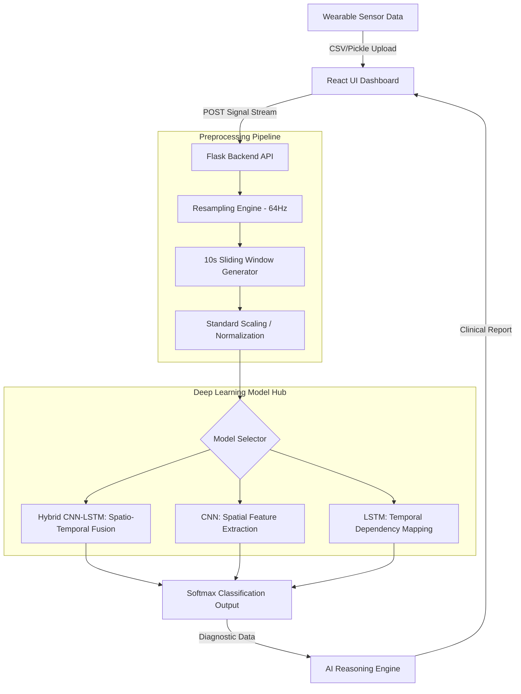

# NeuroCalm: Multi-Modal Deep Learning Stress Diagnostic Suite
## Project Technical Documentation

### 1. Problem Statement
In modern clinical psychology, early detection of high-intensity stress is critical for preventing long-term mental health deterioration. Traditional monitoring often relies on self-reporting or sporadic clinical visits, which lack real-time granularity. 

**NeuroCalm** addresses this by leveraging wearable physiological sensors to provide continuous, high-fidelity stress diagnostics. The challenge lies in processing asynchronous, multi-modal biological signals (EDA, Heart Rate, Temperature) into a unified temporal sequence that a deep learning model can interpret with clinical accuracy.

---

### 2. Block Diagram (System Architecture)

---

### 3. Overall Overview
NeuroCalm is a production-grade SaaS platform designed for physiological analysis. It uses the **WESAD (Wearable Stress and Affect Detection)** dataset as its benchmark. 

*   **Front-End**: Built with React.js using Glassmorphic design principles. It features synchronized Recharts visualizations for real-time biosignal monitoring.
*   **Back-End**: Powered by Python and Flask, hosting a set of PyTorch models through a Global Model Hub for low-latency inference.
*   **Clinical Reasoning**: Integrates rule-based clinical guidance and AI explainability (SHAP-inspired impact drivers) to provide "Human-in-the-Loop" diagnostics.

---

### 4. Preprocessing Pipeline
Physiological signals are inherently noisy and asynchronous. NeuroCalm implements a rigorous transformation pipeline:

1.  **Unified Resampling**:
    *   **Originals**: EDA (4Hz), TEMP (4Hz), BVP (64Hz), ACC (32Hz).
    *   **Target**: All signals are unified to **64Hz** using linear interpolation to ensure temporal alignment across the 7 input channels.
2.  **Windowing**:
    *   Data is partitioned into **10-second windows** (640 samples per window).
    *   A **5-second overlap (step)** is used to ensure no diagnostic transient is missed.
3.  **Signal Normalization**:
    *   Each channel is normalized using **StandardScaler** (Z-score: mean=0, std=1). This prevents high-amplitude signals like Heart Rate from overshadowing subtle shifts in Electrodermal Activity (EDA).

---

### 5. Deep Learning Models
NeuroCalm supports three distinct architectural paradigms for stress classification:

| Model | Architecture Highlights | Best Used For |
| :--- | :--- | :--- |
| **ConvNet (CNN)** | 3-layer 1D-Convolution, Batch Normalization, Global Average Pooling. | Detecting spatial signatures and local signal spikes in EDA/BVP. |
| **LSTMNet** | 2-layer Bidirectional LSTM with 0.3 Dropout. | Capturing long-range temporal trends and heart rate variability (HRV). |
| **Hybrid CNN-LSTM** | **CNN Stems** (Feature extraction) + **LSTM Layers** (Temporal mapping). | **Default & Best Model**: Combines spatial abstraction with time-series memory. |

---

### 6. Evaluation Metrics
The system is evaluated based on its ability to distinguish between **Baseline (Calm)**, **Stress**, and **Amusement**.

*   **Classification Accuracy**: Measures the overall percentage of correct window predictions.
*   **F1-Score**: Critically used to handle class imbalance (ensuring high stress isn't missed even if it's less frequent).
*   **Confidence Score**: Each prediction is accompanied by a Softmax probability percentage, indicating the AI's diagnostic certainty.
*   **Temporal Stability**: We measure "Session Smoothness"—the model's ability to maintain a consistent state prediction across consecutive windows in a session.

---

### 7. Clinical Recommendations
Based on the **Overall Stress Score (%)**, the system triggers a rule-based recommendation engine:
- **Low Stress (0-40%)**: "Stable and relaxed physiological state."
- **Moderate Stress (41-70%)**: "Take a short break. Fatigue detected."
- **High Stress (71-100%)**: "Action Required: High sympathetic activation. Initiate 4-7-8 breathing exercise."
